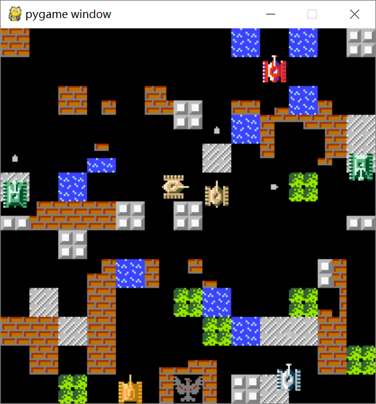

# 坦克大战（BattleCity）实验报告

## 游戏简介：
> 在此游戏里，玩家操作一辆坦克，分别为黄色和绿色坦克，必须消灭所有电脑控制的敌军坦克，而且保护自己的基地。在游戏中，基地的图标是一支老鹰。每一关有20辆敌军坦克。如果他的基地、老鹰被射中、或玩家的所有坦克全部被击毁，游戏便告终止。
> —— wikipedia

## 方案
### 游戏数据方面
地图由三个部分组成：`Block`类、`Tank`类和`Missile`类。它们都有个共同的基类`Object`。  
每个类里有其对应的实例列表，如`Block`类有一个叫`blocks`的列表，用于存放所有的`block`。每次更新时，便依次对这个列表里的每个元素调用`updates()`成员函数。当系统检测到某一个`block`应当从地图上移除时，便将其从`blocks`列表中移除，这样该`block`就不会参与之后的更新。`Tank`类与`Missile`类同理。  
每隔10ms，系统会依次更新所有`block`、`tank`、`missile`的位置，并在更新`missile`位置的同时作撞击判定。当检测到某个`missile`与其他`Object`发生碰撞时，调用对方的`get_hit_by()`成员函数，以及自己的`explode()`成员函数，完成一次撞击结算。
绘图方面，所有的绘图都交由精灵处理。每个`object`在初始化时都会绑定一个对应的精灵（如：`Tank`类的实例在构造函数中会绑定一个`TankSprite`类的实例）。同理，每隔10ms，在更新完所有`object`的位置后，对所有的精灵调用其`renders()`成员函数，完成绘制。

### 流程方面
在主循环中处理消息。当消息为计时器消息时，先更新数据，再进行绘图。

## 总结与不足
这1072行代码是我重写了两遍的结果。每次重些的目的是为了增加代码可读性与扩展性（比如我第一次重写之前，没有用到面向对象，也没有用到精灵，写起来就很痛苦）。然而即便是写了两遍，还是有很多问题。我已经不想去改了。希望自己以后能尽可能从一开始就写出规范的代码。